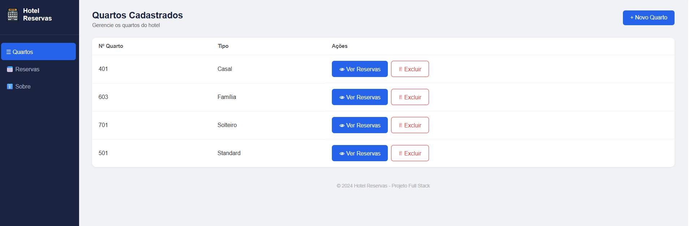
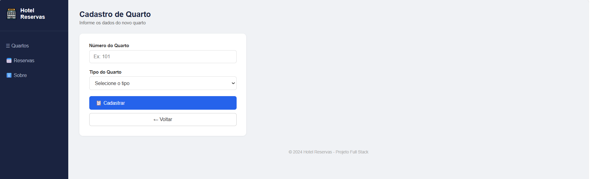
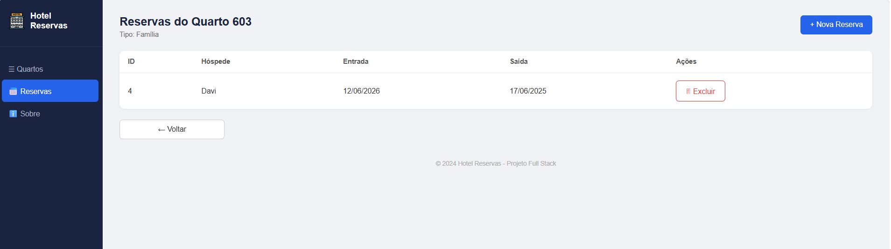
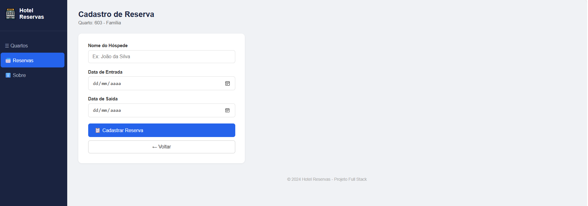
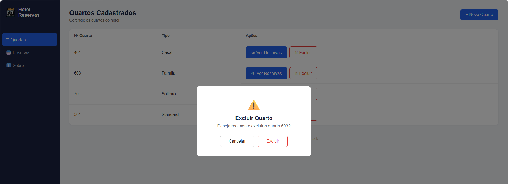

# 🏨 Hotel Reservas

Sistema de gerenciamento de quartos e reservas de hotel, desenvolvido como projeto Full Stack.

---

## 🛠️ Tecnologias Utilizadas

- **IDE:** Visual Studio Code
- **Front-end:** HTML, CSS e JavaScript puro
- **Back-end:** Node.js com Express
- **ORM:** Prisma
- **Banco de dados:** MySQL 8.0
- **Servidor:** Node.js v22.17.1

---

## ⚙️ Como Executar o Projeto

### Pré-requisitos
- Node.js instalado
- MySQL instalado e rodando
- XAMPP ou outro servidor MySQL ativo

### 1. Clone o repositório
```bash
git clone https://github.com/SEU_USUARIO/hotelreservas.git
cd hotelreservas
```

### 2. Configure o Back-end
```bash
cd api
npm install
```

Crie o arquivo `.env` dentro da pasta `api/`:

```env
PORT=3000
DATABASE_URL="mysql://root@localhost:3306/hotel_db"
```

Rode as migrations para criar o banco e as tabelas:
```bash
npx prisma generate
npx prisma migrate dev --name init
```

Inicie o servidor:
```bash
npm run dev
```

A API estará disponível em: `http://localhost:3000`

### 3. Execute o Front-end

Abra o arquivo `web/index.html` diretamente no navegador.

---

## 🗄️ Banco de Dados

### Tabela: quartos
| Campo  | Tipo        |
|--------|-------------|
| id     | INT (PK)    |
| numero | VARCHAR(10) |
| tipo   | VARCHAR(50) |

### Tabela: reservas
| Campo        | Tipo         |
|--------------|--------------|
| id           | INT (PK)     |
| hospede      | VARCHAR(100) |
| data_entrada | DATE         |
| data_saida   | DATE         |
| quarto_id    | INT (FK)     |

---

## 🖥️ Telas do Sistema

### 1. Tela Principal — Lista de Quartos


### 2. Cadastro de Quarto


### 3. Reservas do Quarto


### 4. Cadastro de Reserva


### 5. Excluir Quarto (Confirmação)


---

## 📋 Rotas da API

| Método | Rota                        | Descrição              |
|--------|-----------------------------|------------------------|
| GET    | /quartos                    | Lista todos os quartos |
| POST   | /quartos                    | Cadastra um quarto     |
| DELETE | /quartos/:id                | Exclui um quarto       |
| GET    | /reservas/quarto/:quarto_id | Lista reservas do quarto |
| POST   | /reservas                   | Cadastra uma reserva   |
| DELETE | /reservas/:id               | Exclui uma reserva     |